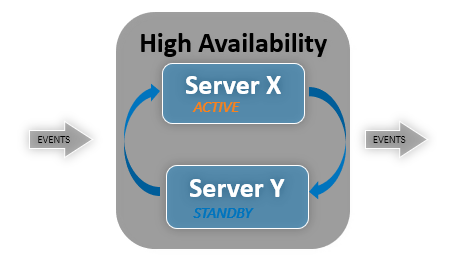
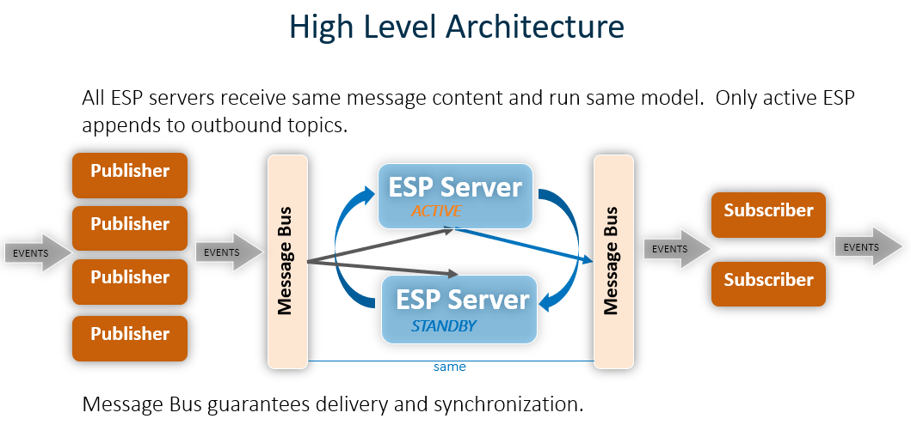
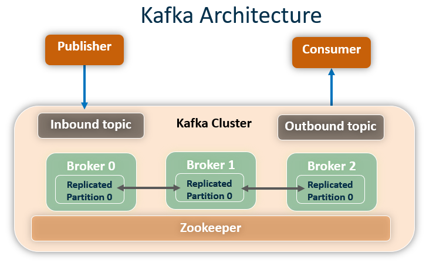
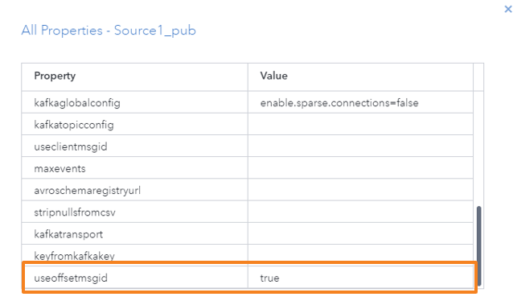
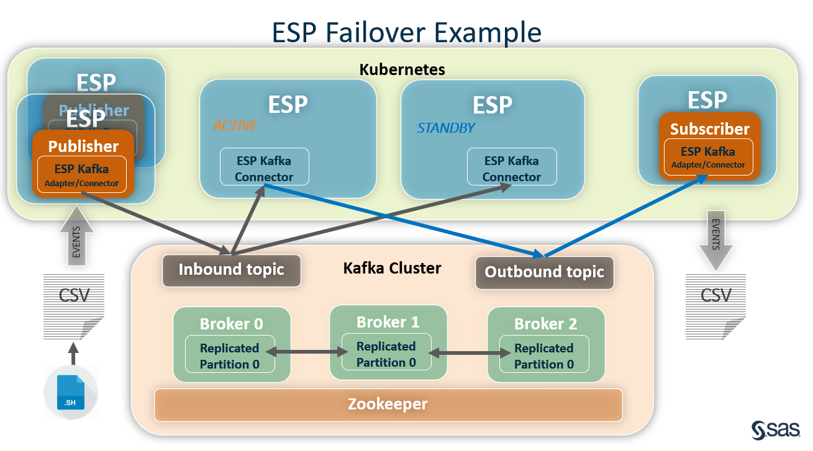
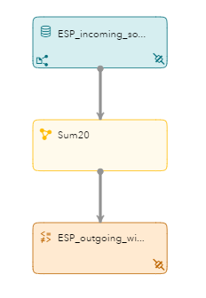
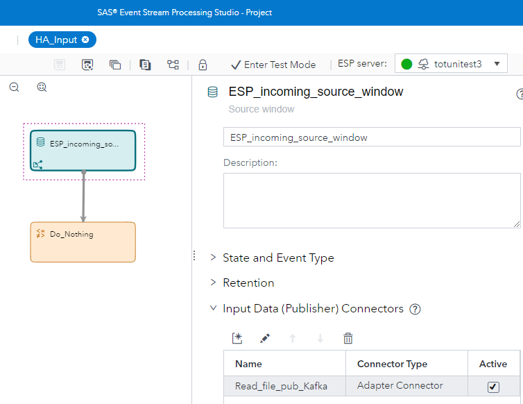
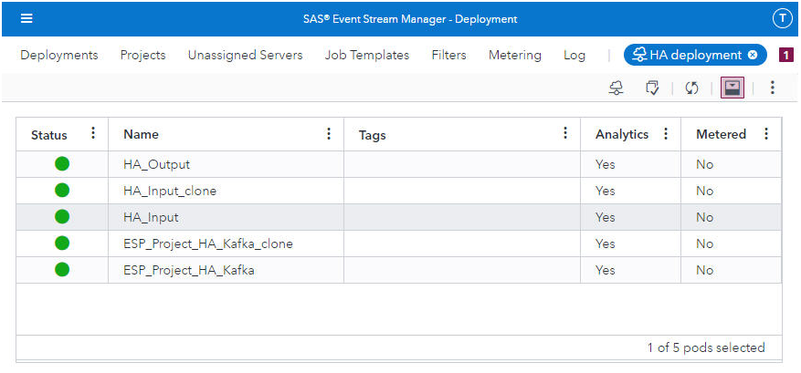
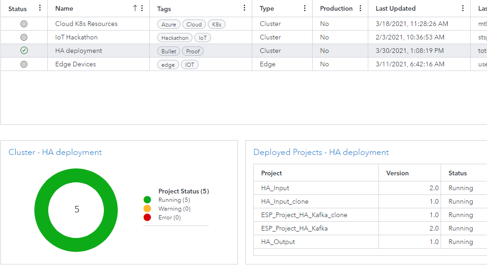

# ESP High Availability using Kafka with Viya 4

In this repository, you'll Learn how to create and deploy an ESP high availability system using Kafka as the message broker.


## Overview

There are three message buses supported for ESP failover: Solace, RabbitMQ and Kafka.  This repository will show you how to use [SAS Event Stream Processing (ESP)](https://www.sas.com/en_us/software/event-stream-processing.html) in conjunction with a [Kafka](https://kafka.apache.org/) message bus to build a real time fault-tolerant application which provides analytic services.  

This repository will cover the following topics: 

  *  Define high availability
  *  Learn the basics of the Kafka message bus
  *  Learn how to deploy an ESP project in failover mode
  *  Show an end to end example
  

## Why is high availability important? 

When building critical applications which require continuous operation, these systems must eliminate single points of failure.  This is achieved by creating redundancy at all levels.  For example, hospitals and airports require high availability to perform daily activities.  When a portion of the IT infrastructure is broken the end users must still have access to key systems to do their work.  The idea is to ensure uninterrupted processing of data in the event of a failure within a business critical environment.



This diagram illustrates an 1 + N system.  Here we have one active server X processing events and one standby server Y.  In the event of system failure of server X, server Y takes over and events continuously flow through the system. When we expand this diagram further we see how ESP becomes the 1 + N server cluster in the HA system.  



High availability is achieved by building redundancy into every level of the architecture.  Redundant publishers guarantee messages are delivered to the message broker.
The Kafka message broker ensures message delivery through replicated brokers and topics.
Failover in ESP is accomplished by seamlessly transitioning events generated by subscribed windows from an active instance of an ESP engine to a standby instance
when the active instance fails and multiple subscribers ensures message delivery.  


## Kafka Basics

Apache Kafka is a community distributed event streaming platform that is used for publishing and subscribing to streams of events. 
It was originally developed by LinkedIn and became open source in 2011.  Kafka aims to provide a unified, high-throughput, low-latency platform for handling real-time data feeds.
Here are important concepts that you need to remember before we dig deeper into Apache Kafka.

  **Kafka Cluster**  These typically consists of multiple brokers to maintain load balance. Kafka brokers are stateless, so they use ZooKeeper for maintaining their cluster state.     
  **ZooKeeper** These are used for managing and coordinating Kafka brokers. The ZooKeeper service is mainly used to notify producers and consumers about the presence of any new broker in the Kafka system or failure of the broker in the Kafka system.     
  **Broker** The Kafka nodes that receive messages from producers, stores messages in topics and retrieves messages for consumers.     
  **Producer**  The application that publishes messages to topics within Kafka.     
  **Consumer** The application that subscribes to one or more topics and processes the stream of messages produced to them.     
  **Topic**  A category or feed name to which messages are published and stored; topics may have zero, one or more consumers that subscribe to it.      
  **Partition**  Messages/events are stored in one or more partitions of a topic; they are appended to a structured commit log and assigned a sequence id, called the offset.      
  **Offset** Each partitioned message has a unique sequence id called as offset.    
  **Replica** A replica of a partition is a "backup" of a partition. Replicas never read or write data. They are used to prevent data loss.       
  
   
  
  
A Kafka cluster consists of one or more servers (Kafka brokers), which are running Kafka.
Producers are processes that publish data (push messages) into Kafka topics within the broker.
A consumer of topics pulls messages off a Kafka topic.
To support ESP failover a High Availability cluster must be created with both redundant brokers and replicated topics.
Kafka recommends 3 + ZooKeeper servers and 3 + brokers as a minimum HA cluster.  However, for this example, we will set up one ZooKeeper and three brokers.
Due to the fact that Kafka brokers maintain an offset for each partition used, we must define the brokers to use only one partition.
This ensures the ESP message IDs are sequenced correctly at all times.  The partition is represented here as partition 0.
Each ESP topic created must be replicated across all three brokers in the cluster.
For example, events published to broker 0 are automatically replicated across all three brokers.  When broker 0 dies, brokers 1 and 2 take over in support of the topic.
By listing the topics we can view which topics have been created. Here we can see that Incoming and Outbound topics denoted by I and O respectively.

`./list-topics.sh`
```diff
ESPAdapterMetapub
ESPAdapterMetasub
HAtopic1_31415.ESP_Project_HA_Kafka.ESP_CQ.ESP_incoming_source_window.I
HAtopic1_31415.ESP_Project_HA_Kafka.ESP_CQ.ESP_outgoing_window.O
HAtopic1_31415.M
```


By using the --describe parameter we can see the incoming topic has a partition count of 1 and a replication factor of 3.  Messages will be retained for 30000 milliseconds before being purged, and the list of In Sync Replicas (ISR) contains 1,2 and 0.  

`./describe-topic.sh HAtopic1_31415.ESP_Project_HA_Kafka.ESP_CQ.ESP_incoming_source_window.I`
```diff
HAtopic1_31415.ESP_Project_HA_Kafka.ESP_CQ.ESP_incoming_source_window.I  
Topic: HAtopic1_31415.ESP_Project_HA_Kafka.ESP_CQ.ESP_incoming_source_window.I  PartitionCount: 1       ReplicationFactor: 3    Configs:  
Topic: HAtopic1_31415.ESP_Project_HA_Kafka.ESP_CQ.ESP_incoming_source_window.I  Partition: 0    Leader: 1       Replicas: 1,2,0 Isr: 1,2,0  
```

**Note** All Kafka helper scripts can be found in the ./KafkaScripts directory of this repository.   

### Setting up a Kafka Cluster

This repository contains example scripts with pre-configured properties files
which may be used to start a HA Kafka cluster which matches the architecture
defined above.  These scripts must be downloaded into the directory `/opt/kafka/myscripts` or edited to match your environment.  From the myscripts directory issue the     
`./run-cluster.sh`  command to start up the cluster which includes 3 brokers and 1 ZooKeeper server.  It is also assumed that the latest version of Kafka 
is installed in the `/opt/kafka` directory.  If your environment is different simply change the path names at the top of each script.
The hostname defined in these sample scripts must be changed.  Please edit the serverX.properties files to match your installation.  

When setting up a cluster from scratch we need to configure properties files for both ZooKeeper and 1 + N brokers and use those files to start the servers.
To understand the process I will highlight the key settings in each of these files.
Please note that the settings created here are also referenced in the ESP xml model that will be created which interacts with the Kafka cluster.
First let's start with [zookeeper.properties](./KafkaScripts/zookeeper.properties). 
These are the key fields which need to be defined.

  **dataDir** The directory where the snapshot is stored.    
  **clientPort**  The port at which the clients will connect.    
  **tickTime** The length of a single tick, which is the basic time unit used by ZooKeeper, as measured in milliseconds.    
  
The Zookeeper configuration must specify a value for tickTime no greater than 500 milliseconds.
This enables subscriber connectors acting as Zookeeper clients to detect a failed client within one second, and to initiate the switch over process.  
  
An example ZooKeeper properties file might look like this:   
  
```diff
dataDir=/tmp/zookeeper
clientPort=2181
maxClientCnxns=0
tickTime=500
autopurge.purgeInterval=24
syncLimit=5
initLimit=10
```

Now let's look at how to define a brokers property file.  Kafka brokers use a property file to store their configuration. To create a broker, please note the following changes are required for each broker property file.  These settings must be unique for each broker.

  **broker.id** This is the id of the brokers in the cluster.    
  **log.dirs** This is where log will be stored.      
  **listeners** The address the socket server listens on.     
  **Zookeeper.connect**  Zookeeper connection string.      
  **offsets.topic.replication.factor**  Topic replication factor.        
  **transaction.state.log.replication.factor**      
  **transaction.state.log.min.isr**  Minimum in sync replicas     
  **default.replication.factor**  When creating new topics default replication factor.      
  **delete.topic.enable**  Allow topics to be deletable.   
  **num.partitions**  The default number of log partitions per topic.     
  
`num.partitions` must be set to 1 because Kafka maintains record order only in a single partition. Therefore, we need to specify a dedicated partition to be used for the ESP connector to make sure the order of events streaming into ESP projects running across ESP engines are identical.  Also, Kafka topics are only fault tolerant when the replication factor is greater than 1.  Therefore, we must set the `transaction.state.log.replication` setting to 3.  

Below is a partial example of Kafka broker property file such as [server0.properties](./KafkaScripts/server0.properties) which contains the settings necessary to support ESP failover.

```diff
# The id of the broker. This must be set to a unique integer for each broker.
broker.id=0
listeners=PLAINTEXT://<your hostname>:9092
delete.topic.enable=true
# A comma separated list of directories under which to store log files
log.dirs=/tmp/kafka-0
num.partitions=1
default.replication.factor=3
# The replication factor for the group metadata internal topics "__consumer_offsets" and "__transaction_state"
offsets.topic.replication.factor=3
transaction.state.log.replication.factor=3
transaction.state.log.min.isr=1
zookeeper.connect=<your host name>:2181
log.retention.check.interval.ms=30000
```

Now that we have created the Zookeeper and broker properties files we must use them to start the servers.  The [run-server](./KafkaScripts/run-server0.sh)
command from the kafkascripts directory contains a great example.  The command will be similar to the following: 
```
$BPATH/kafka-server-start.sh $SPATH/server0.properties"
```

Remember, to achieve true redundancy at least 3 ZooKeeper servers and 3 brokers must be used.  


### Creating Replicated Topics for ESP Failover

Now that we have a Kafka cluster defined and running, we need to create topics or message queues that will run on those servers. 
To support ESP failover these topics need to be defined using a replication factor of 3 and a partition count of 1. 
ESP failover is achieved via the use of 3 replicated Kafka topics.  Each adapter will also need a topic created.  This topic name is defined 
in the kafka.cfg file described later.  
Please see [create-replicated-topics.sh](./KafkaScripts/create-replicated-topics.sh) for an example of how to create these topics. 
Also note that ESP will create these topics if they are not present when the ESP model starts.
However, it is best to create them in advance to ensure the correct replication and partition settings are used which match your environment.  

* Metadata topic provides synchronization of ESP model metadata between ESP engines and ESP pubsub clients
* Inbound topic receives publisher events from clients
* Outbound topic receives events used by Kafka subscribers
* Adapter Meta topics provide synchronization for ESP adapters
  


Now with Viya 4 ESP servers are spun up using Kubernetes and given dynamically calculated names.
Therefore, the first section of the topic name no longer references the host name of the ESP server running the project.
The first section of the topic name may be anything that makes sense for your installation.
However, the next three sections much match the ESP server project exactly.
ESP models contain the following structures: projects, continuous queries and windows.  
For example, 
`./list-topics.sh`
```diff
ESPAdapterMetapub
ESPAdapterMetasub
HAtopic1_31415.ESP_Project_HA_Kafka.ESP_CQ.ESP_incoming_source_window.I
HAtopic1_31415.ESP_Project_HA_Kafka.ESP_CQ.ESP_outgoing_window.O
HAtopic1_31415.M
```
breaks down as follows:

  **ESP_Project_HA_Kafka** ESP project name.  
  **ESP_CQ** Continuous query name in the project.  
  **ESP_incoming_source_window** Name of the source window in the project.  
  **ESP_outgoing_window** ESP window containing outbound connector.  
  **I/O** Denotes incoming or outgoing.  
  **M**  Stores meta data.  
  
When the HA project starts it connects to Kafka and stores vital project information using these topics.
When an adapter starts, it connects to Kafka and retrieves the information it needs to start correctly.

These topics are also referenced by the ESP xml model and the ESP adapter/connector declarations.
If we look at the xml model we can see that the publisher connector definition references the topic.
```
<property name="kafkatopic"><![CDATA[HAtopic1_31415.ESP_Project_HA_Kafka.ESP_CQ.ESP_incoming_source_window.I]]></property>
```
Similarly, the publisher adapter/connector declaration must also match this topic name.
Here a file and socket adapter would use the Kafka transport option to send messages via the message bus.
```
dfesp_fs_adapter -C type=pub,fsname=/mnt/viya-share/esp/HA_Input_data.csv,fstype=csv,transport=kafka,transportconfigfile=/mnt/viya-share/esp/kafkapub.cfg....

```
The same topic name must be used in three places,
- Kafka publisher topic
- ESP xml connector configuration
- ESP adapter/connector start string 

for events to flow into an ESP project.

The metadata topic is referenced in the ESP project xml as urlhostport.
In this example the metadata topic **HAtopic1_31415.M** is represented as follows in the project xml:
```
 <property name="urlhostport"><![CDATA[HAtopic1_31415]]></property>
```


### Kafka Retention and ESP Recovery

ESP Recovery refers to the restart process of a failed ESP server so that it returns to standby state, exactly mirroring the active ESP server. 
For this recovery to happen, ESP needs access to enough of the Kafka inbound message queue to reproduce the active ESP server state and have enough extra processing 
power to replay these messages in a timely fashion. 
The general rule is that the topic retention setting should exceed the ESP retention settings and the ESP Kafka connector should use the offset ID supplied by the 
Kafka broker instead of allowing the ESP server to dynamically create them.
Here is an example of how to set the useoffsetmsgid property correctly:   

     


## ESP and Failover

SAS Event Stream Processing uses message buses to provide failover at the ESP engine level. 
The message bus provides a mechanism to signal to an event stream processing engine that it is the active engine in the cluster. 
The message bus provides a way for an engine, when notified that it is active, to determine the last message published by the previously active engine. 
The newly active engine can resume publishing at the appropriate point in the message stream.
Event stream processing engines are deployed in 1 + N redundancy clusters. 
All engines in the cluster subscribe to the same topics on the message bus, and hence receive exactly the same data. 
However, only one of the engines in the cluster is deemed the active engine at any time. 
Only the active engine publishes data to the downstream subscribers. 
This is accomplished by, 

 * by running identical ESP models
 * all ESP models receiving the same messages in the same order
 * extracting message IDs from the incoming messages
 * buffering messages by the standby ESP engine Kafka connector

You can configure a message bus connector or adapter to exchange CSV, JSON, or data in other text formats across the message bus.
However, when enabled for failover, 
messaging publishers and subscribers must exchange binary event blocks. This is because only binary event blocks contain the required message IDs.
Synchronization occurs because of buffering of messages by standby connectors and coordination of the resumed flow with the Kafka cluster. 




This is a generic representation of a failover scenario. Each ESP engine is running the same project,
but only one is active and the remaining instance is standby. Each ESP server has the same state.
Each ESP server is running 1 Kafka publisher connector (this inputs data into ESP) and one Kafka subscriber connector (writes to outbound topic).
First a bash script writes data to a file.
Then the publisher adapter, publishes events through Kafka via the transport option of the ESP file and socket adapter.
However any adapter may be used that supports the transport option.
Messages flow into the ESP project through a publisher connector. 
The subscriber connector in the ESP project of the active ESP server writes messages to the outbound topic.
After the messages are processed in the project the subscriber adapter then retrieves the messages from the message bus for post-processing.
The subscriber adapter also uses the transport option to retrieve messages. 
When the active instance fails the message ID number is used to synchronize events to resume subscribing events on a standby instance.
Using the same offset is required to ensure an identical state in all involved servers. 

For this example events flow through the system in this order.

 * The ESP **publisher adapter/connector** writes messages to the inbound topic.    
 * The ESP **publisher connector** within the ESP model reads events off the inbound topic.  The event is now available to be processed by the ESP project.     
 * Once the event is transformed by ESP, the ESP **subscriber connector** writes the data to the outbound topic.     
 * The ESP **subscriber adapter/connector** reads the outbound topic and writes the data to a csv file.    

### ESP Project Definition

Next we need to define the ESP project which will communicate with our Kafka cluster, created earlier. 
This project will need 1 publisher connector and 1 subscriber connector defined as well as some logic to transform the event data.
For reference please refer to the [ESP project](./ESPScripts/ESP_Project_HA_Kafka.xml)  which is part of this repository. 
This is a pictorial representation of the ESP project.
You can see that we have an incoming source window which contains our publisher connector.
One window which transforms the event and the ESP_outgoing_window which contains the subscriber connector.




In this example, we will use 5 ESP servers 3 Kafka brokers and 1 zookeeper node to achieve high availability.
Two ESP servers will run our project.  Two will publish to our inbound topic and lastly we need a subscriber.
The subscriber does not need redundancy because Kubernetes will restart it upon failure 
and no messages will be lost because they are still on the outbound Kafka topic waiting to be read.

In order to read messages from the incoming Kafka topic,
we must define a publisher connector with settings that match the Kafka cluster which was defined earlier.
Here is a list of parameters for the Kafka publisher connector and their definitions:

  **type** Must be set to publish or "pub"    
  **dateformat** This must match the data format used in the adapter start script.        
  **kafkainitialoffset** Specifies the offset from which to begin consuming messages from the Kafka topic and partition.     
  **kafkaglobalconfig**  Holds any special configuration parameter values.  Here we set sparse connections to false to prevent any message delivery delays.     
  **useoffsetmsgid**  Use Kakfa offset as sequence number of messages instead generating the sequence number by ESP.  Improves recovered ESP server sync time.      
  **kafkahostport**  Specifies one or more Kafka brokers.  Even if only one broker is specified the other brokers in the cluster are discovered and used by ESP.     
  **kafkapartition**  Kafka partition used by the incoming topic.  
  **kafkatopic** Kakfa incoming topic name.     
  **kafkatype**  Must be set to binary to support failover.    
  **urlhostport**  Metadata topic name before .M is appended.   
  
Below is an example of the publisher connector which matches the Kafka cluster. 
```
<connector class="kafka" name="kafka_IN">    
      <properties>
        <property name="type"><![CDATA[pub]]></property>
            <property name="dateformat"><![CDATA['%Y-%m-%d %H:%M:%S]]></property>
            <property name="kafkainitialoffset"><![CDATA[largest]]></property>
            <property name="kafkaglobalconfig"><![CDATA[enable.sparse.connections=false]]></property>
            <property name="useoffsetmsgid"><![CDATA[true]]></property>
            <property name="kafkapartition"><![CDATA[0]]></property>
            <property name="kafkahostport"><![CDATA[totunitest3-jump-vm:9092]]></property>
            <property name="kafkatopic"><![CDATA[HAtopic1_31415.ESP_Project_HA_Kafka.ESP_CQ.ESP_incoming_source_window.I]]></property>
            <property name="kafkatype"><![CDATA[binary]]></property>
            <property name="urlhostport"><![CDATA[HAtopic1_31415]]></property>
      </properties>
    </connector>
```

Now we will define the subscriber connector which will place messages on the outbound topic.
We must define the subscriber connector with settings that match the Kafka cluster which we defined earlier.
Most of the parameters are shared between pub and sub connector. 
Here is a list of parameters which differ for the Kafka subscriber connector and their definitions:

  **type** Must be set to subscriber or "sub"      
  **numbufferedmsgs** This specifies the number of messages the connector will keep in its buffer so a standby server can synchronize to the last message processed by the failed active server engine.     
  **hotfailover**  Specifies that ESP run in failover mode.     
  **zookeeperhostport**  Hostname and port where ZooKeeper is located.     
  **kafkatopic** Kakfa outgoing topic name.         

Below is an example of the subscriber connector which matches our Kafka cluster. 
  
```
<connector class="kafka" name="kafka_OUT">
      <properties>
        <property name="type"><![CDATA[sub]]></property>
            <property name="dateformat"><![CDATA['%Y-%m-%d %H:%M:%S]]></property>
            <property name="hotfailover"><![CDATA[true]]></property>
            <property name="zookeeperhostport"><![CDATA[totunitest3-jump-vm:2181]]></property>
            <property name="kafkaglobalconfig"><![CDATA[enable.sparse.connections=false]]></property>
            <property name="snapshot"><![CDATA[false]]></property>
            <property name="kafkahostport"><![CDATA[totunitest3-jump-vm:9092]]></property>
            <property name="kafkapartition"><![CDATA[0]]></property>
            <property name="kafkatopic"><![CDATA[HAtopic1_31415.ESP_Project_HA_Kafka.ESP_CQ.ESP_outgoing_window.O]]></property>
            <property name="kafkatype"><![CDATA[binary]]></property>
            <property name="urlhostport"><![CDATA[HAtopic1_31415]]></property>
            <property name="numbufferedmsgs"><![CDATA[1000]]></property>
      </properties>
    </connector>
```

Once the ESP xml model is configured with the proper pub and sub connectors you are ready to load this project into ESP.  


### ESP Adapter/Connector Definition 

Now that the ESP model is up and running it is waiting for data.
The ESP project pub connector becomes a Kafka consumer of the inbound topic.
We need a way to publish data to the inbound topic.  We are going to do that using an ESP publish adapter/connector.
In previous versions of Viya one would start an adapter from any virtual machine.
In Viya 4 we will use Kubernetes to spin up a pod which contains everything we need to start our adapter.
A simple ESP project is created which contains an adapter/connector.
This is really the same as running the ESP adapter from a command line once the pod spins up.
But now we have the added advantages of using Kubernetes.
In order to set up a truly redundant system with no single points of failure we will define 2 publisher adapter/connector ESP projects
working together in failover mode.
Only the active Kafka publisher adapter would publish to the incoming topic defined in the ESP project.
Please see "Publisher Adapter Failover with Kafka" in the ESP documentation for full details.

Each adapter requires a companion file called  [kafkaxxx.cfg](./ESPScripts/kafkapub.cfg).
This configuration file tells the adapter important Kafka connection information, as well as several other parameters.
This file must be located in the directory where the ESP adapter/connector pod has access.
In a Kubernetes environment, this would be a common PVC like /mnt/data or any NFS mounted storage.

  **hostport** refers to the Kafka broker location.     
  **metatopic** must match the metatopic which was created earlier.     
  **enable.sparse.connections=false** is used to ensure messages are delivered when received by the adapter.    
  **initialoffset** specifies the offset from which to begin consuming messages from the Kafka topic and partition.    
  


Here is an example:
```
kafka 
{
hostport = "totunitest3-jump-vm:9092"
globalconfig = "enable.sparse.connections=false"
partition = "0"
initialoffset = "largest"
groupid = "ESPadaptergroup1"
metatopic="ESPAdapterMetapub"
}
sas 
{
hotfailover=true
zookeeperhostport="totunitest3-jump-vm:2181"
failovergroup="ESPadaptergroup1"
numbufferedmsgs="1000"
dateformat="%Y-%m-%d %H:%M:%S"
}

```

Once the kafka.cfg file is ready we need to create an inbound ESP project which reads from a growing CSV file and publishes to our Kafka topic.

An example [publish adapter/connector project ](./ESPScripts/HA_Input.xml) is located in the ESPscripts directory.



Note that the output data published by the adapter must match the input schema of the main project xml.  For example, if your data contains the number
12.12 and your schema is defined as int64 the adapter will fail to start.

Finally we need a client to retrieve events from the Kafka outbound topic, which was specified in the subscriber connector definition.
This can be a simple file and socket adapter so that it is easy to track events by tailing the output file.

An example [subscriber adapter/connector project](./ESPScripts/HA_Output.xml) is located in the ESPscripts directory.

Once started this adapter will pull events from the Kafka outbound topic and place them in a csv file on the local file system.
This file may then be tailed to display the results generated by the high availability system.


## Failover in action

Now that all the components have been put into place it is time to step through the failure process.
Our models will run as part of an Event Stream Manager deployment.
ESM can only build models from published versions.  So the first step is to create a published version of each project from ESP Studio.

For this project we will create an HA deployment in SAS Event Stream Manager so that all 5 
ESP projects can be managed as one entity and it looks like this: 

    

Here we see 2 HA input projects and 2 HA main projects as well as one subscriber or output project.
Each project runs in its own pod managed by Kubernetes.
Kubernetes will restart a failed pod automatically  ensuring that the deployment is always up.

First we start the two ESP servers running the project xml using identical project xml files.
The xml must be identical to ensure that the project state and sequencing are consistent. 
The first ESP started will become the active ESP server while the second will become the standby.
The ESP log will contain the following message on ESP server 1.
```
dfESPkafkaConnector::goActive(): Hot failover state switched to active
```
While the second ESP server will be switched to standby as indicated by the log.
```
dfESPkafkaConnector::start(): Hot failover state switched to standby
dfESPconnector::setState(): Connector kafka_OUT in group default has new state: running
dfESPkafkaConnector::z_watcher(): Zookeeper watcher event: watcher = SESSION_EVENT, state = CONNECTED_STATE, path = 
dfESPkafkaConnector::z_watcher(): Created zookeeper node /ESP/server-n_0000000018
dfESPconnector::setState(): Connector kafka_IN in group default has new state: running
starting esp server with 1 project(s)
dfESPkafkaConnector::watchActiveZnode(): Watching zookeeper node /ESP/server-n_0000000017
```
Notice that ZooKeeper is used to keep track of which ESP server is active and which is standby via the creation of nodes.
The log also indicates that the inbound and outbound connectors have reached a running state.
When the active ESP server is stopped the standby server seamlessly picks up and starts publishing events to the outbound Kafka topic.

Next start the 2 publisher ESP projects which contain the same failover capabilities as the main project.
This means that if one of the input adapter/connectors fail the standby publisher will seamlessly take over and become the active publisher.
Lastly, start the output or subscriber project.

Using ESM we can quickly see the overall status of our HA deployment.

    

Here we can see an overall status of the deployment as well as model versioning. 


Using this HA method not only guarantees message delivery, it also allows us to maintain something called state.
You may remember from our ESP project that we included a calculate window.
This calculate window saves the last 20 streaming records in the ESP server memory so that a sum can be calculated.
When your streaming project includes state it is important not to lose it during a standby to active change over.
Since both ESP projects are receiving the same data from Kafka their internal memory which contains state is identical.
Therefore, at change over state is maintained.
If we look at the output file created the last column contains the sum20 value.

```
opcode,flags,index_esp,Record_Counter,MemoryUsed,MemoryFree,epoch,sum20

I,R, 323,325,4846,55038,1617126209,6310.000000
I,R, 324,326,4845,55038,1617126214,6330.000000
I,R, 325,327,4846,55038,1617126219,6350.000000
I,R, 326,328,4846,55038,1617126224,6370.000000
I,R, 327,329,4847,55038,1617126229,6390.000000
I,R, 328,330,4846,55039,1617126234,6410.000000
I,R, 329,331,4846,55037,1617126239,6430.000000
I,R, 330,332,4847,55037,1617126244,6450.000000
I,R, 331,333,4847,55037,1617126249,6470.000000
```

This is an example of the sum20 value not losing state even though the ESP servers have switched from standby to active. 


###  Final Thoughts

ESP and Kafka work together to create a great high availability system with redundancy built into each part of the system.
When combining these two technologies, real-time data pipelines and advanced analytics come together into a fault-tolerant, fast and scalable system.

### Prerequisites

   * [SAS Event Stream Processing](https://www.sas.com/en_us/software/event-stream-processing.html)
   * [Kafka](https://kafka.apache.org/)     


### Installation

This accelerator assumes you have access to an SAS Event Stream Processing.  

## Contributing

This project is not accepting contributions

## License

This project is licensed under the [Apache 2.0 License](LICENSE.txt).

## Additional Resources

Additional resources might include the following:

* [SAS Event Stream Processing](https://www.sas.com/en_us/software/event-stream-processing.html)
* [SAS Communities](https://communities.sas.com/)
* [Kafka Tutorial](http://cloudurable.com/blog/kafka-tutorial-kafka-failover-kafka-cluster/index.html)

